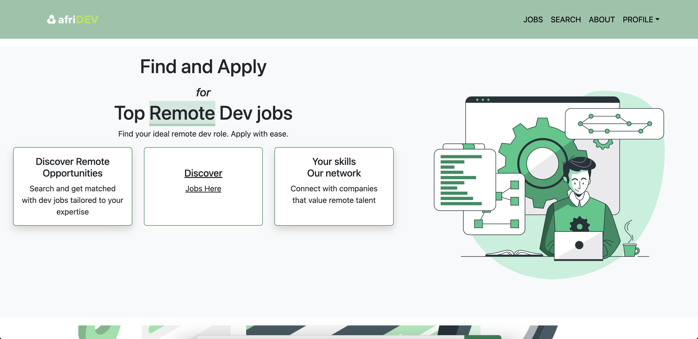

# AfriDev (Job Website)

This is a simple job website that allows users to search for and view job listings directly from the public API at "https://api.crackeddevs.com/". Users can apply for jobs via external links without needing to create an account or log in.

``

## Features

- Job Search: Users can search for available jobs using keywords and location filters.
- Job Listings: Browse through a variety of job opportunities fetched from the API.
- Apply for Jobs: Each job listing provides an external link where users can apply directly, with no need for sign-up or login.
- Pagination: Smooth pagination to browse job listings efficiently.

## Technologies Used

- Front-end: HTML, Bootstrap, React.js
- API: Public API from Cracked Devs

## Installation

1. Clone the repository:

   ```
   git clone https://github.com/Edgar-Macharia/AfriDev
   ```
2. Install dependencies:

   ```
   cd react
   npm install

   ```
3. Create a .env file in the root directory with your API key:

   ```
   REACT_APP_API_URL=https://api.crackeddevs.com
   REACT_APP_API_KEY=your_api_key_here

   ```
4. Start the application:

   ```
   npm start
   ```
5. Access the website:

   Frontend link
   - https://afridev.netlify.app/

## Usage

1. Search for Jobs:

   Navigate to the "Jobs" page.
   Use the search bar to enter job titles, keywords, or locations to filter job listings.
2. View Job Listings:

   Browse through the paginated job listings.
   Click on any job to view more details.
3. Apply for a Job:

   Each job listing includes an "Apply" button that directs you to an external site where you can apply for the job.

## Contributing

Contributions are welcome! If you find any issues or have suggestions for improvement, please submit an issue or create a pull request.

## License

This project is licensed under the [MIT License](LICENSE).

Copyright 2024

By Edgar Macharia
